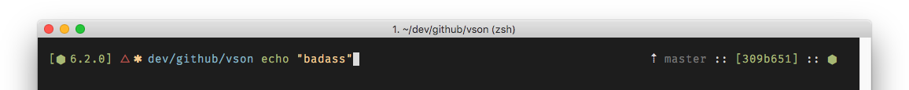

# yardnsm's dotfiles

yep.

These are my dotfiles. A collection of zsh, git and macOS configurations. I built this repo from scratch, while focus on organization.


## Why this repo is different?

Because I have this fancy installer and so many unnecessary stuff.

## Installation

**THIS DOTFILES REPO IS ONLY COMPATIBLE WITH MACOS AT THE MOMENT**

First, make sure that you have Xcode Command Line Tools installed:

```console
xcode-select --install
```

Did that? gr8. Now follow GitHub's instructions on how to [Generate an SSH key](https://help.github.com/articles/generating-an-ssh-key/).

Then, clone the dotfiles repository into `~/dotfiles`. The symbolic links will be created in your home directory (~/).
After that, run the installation script.

**Before** you run the script, you should check what it does. Make sure to check the setup files (located in `_setup`).

```console
# Clone this repo
git clone https://github.com/yardnsm/dotfiles.git ~/dotfiles

# Run the installer!
cd ~/dotfiles
./install.sh
```

It will take some time.

## Order and hierarchy

Everything in this repo is built around topical areas. Each 'topic' has its own directory. In each topic's directory there may be a file called `main.sh`, which is the main topic's installer. There also may be sub-directories like `scripts` (some `.sh` scripts used for installing), `shell` (some `.zsh` files like functions and aliases), `symlinks` (includes files to symlink to the home directory) and `copies` (guess whats in there).

## The Prompt



I moved the prompt into a new repo. Introducing [Blox](https://github.com/yardnsm/blox-zsh-theme) - *(not always)* minimal, clean and highly modular ZSH theme.

## Manual stuff

Too lazy to automate the following:

- Some apps, userscripts (for chrome) and wallpapers are located in `_misc/manuals`.
- Set the folder `iterm/files` as the preferences folder in iTerm.
- Set the folder `alfred/files` as the preferences folder in Alfred.

## Inspired by

- [pure prompt](https://github.com/sindresorhus/pure)
- [Sapegin’s prompt](https://github.com/sapegin/dotfiles)
- [nicknisi's dotfiles](https://github.com/nicknisi/dotfiles)
- [carlos' dotfiles](https://github.com/caarlos0/dotfiles)
- [alrra's dotfiles](https://github.com/alrra/dotfiles)

## TODOs:

- [ ] Add one-command install (curl)
- [ ] Add a sync script
- [ ] Docs?
- [ ] Add support for linux (ubuntu probably).
- [ ] Add more file to 'bin'
- [ ] Achieve 42,956 commits. Add support for windows after that? nah.

## License

MIT © [Yarden Sod-Moriah](http://yardnsm.net/)
