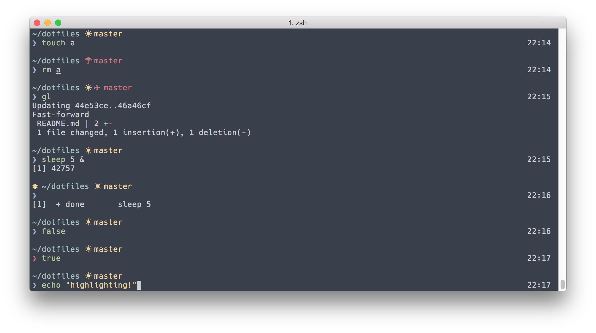

# yardnsm's dotfiles

These are my dotfiles. A collection of zsh, git and macOS configurations. I built this repo from scratch, while focus on organization.



## Installation

**Note:** This only compatible with macOS at the moment.

```console

# Install Xcode Command Line Tools
xcode-select --install

# Clone this repo
# Make sure to generate an SSH key:
# https://help.github.com/articles/generating-an-ssh-key/
git clone https://github.com/yardnsm/dotfiles.git ~/dotfiles

# Change your shell the ZSH
chsh -s $(which zsh)

# Run the installer!
cd ~/dotfiles
./install.sh --full
```

## Order and hierarchy

Everything in this repo is built around topical areas. Each 'topic' has its own directory. In each topic's directory there may be a file called `main.sh`, which is the main topic's installer. There also may be sub-directories like `scripts` (some `.sh` scripts used for installing), `shell` (some `.zsh` files like functions and aliases), `symlinks` (includes files to symlink to the home directory) and `copies` (guess whats in there).

## TODOs:

- [ ] Docs?
- [ ] Add support for linux (ubuntu probably).

## License

MIT © [Yarden Sod-Moriah](http://yardnsm.net/)
